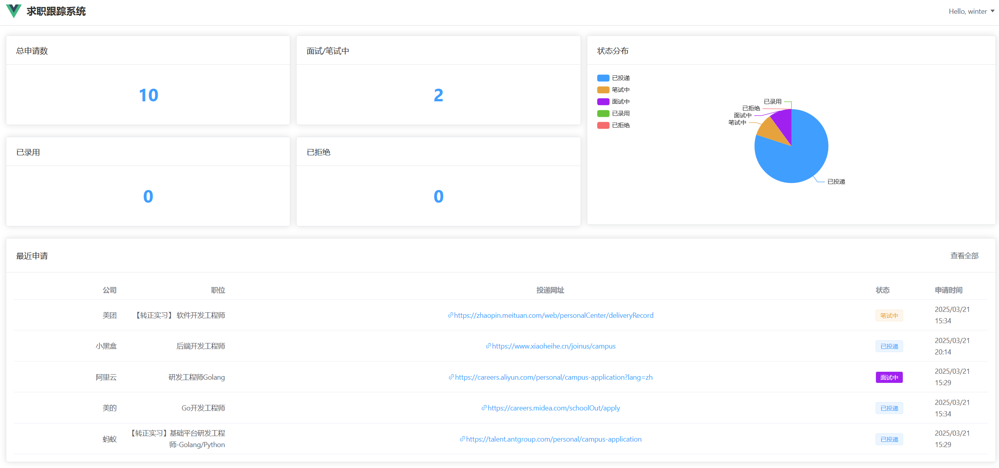
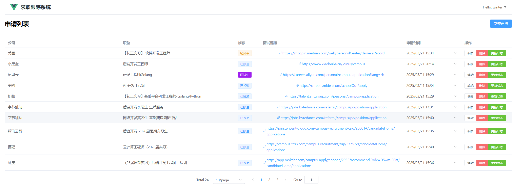

# Resume Manager 求职跟踪系统

## 项目简介 📝

Resume Manager 是一个现代化的求职进度追踪系统，专为实习生和求职者设计。系统提供直观的可视化界面，帮助用户实时掌握各个公司的招聘进度。配合 [auto-resume-tracker](https://github.com/WinterQin/auto_resume_tracker) 可实现邮件自动读取，自动更新求职进度。

## 效果展示





## 技术栈 🛠️

### 前端
- Vue 3
- ElementUI

### 后端
- Go (Gin框架)
- GORM
- MySQL

## 功能特点 ✨

- 📊 求职进度可视化展示
- 📝 申请列表管理
- 🔄 状态实时更新
- 📧 支持通过auto-resume-tracker自动更新进度
- 🎯 直观的进度跟踪

## 快速开始 🚀

### 环境要求
- Go 1.23.x
- MySQL 5.7+
- Node.js 14+
- Docker (可选)

### 本地开发部署

1. 克隆项目
```bash
git clone [项目地址]
cd ResumeManager
```

2. 数据库配置
```bash
# 使用scripts/init.sql创建数据库和表
mysql -u your_username -p < scripts/init.sql
```

3. 后端服务启动
```bash
# 直接编译运行
go build main.go
./main
```

4. 前端服务启动
```bash
cd frontend
npm install
npm run serve
```

### Docker部署

1. 构建后端镜像
```bash
docker build -t resumego .
```

2. 使用Docker Compose启动所有服务
```bash
docker-compose up -d
```

## 项目结构 📁

```
ResumeManager/
├── frontend/           # 前端Vue3项目
├── backend/           # 后端Go项目
│   ├── main.go       # 程序入口
│   ├── controllers/  # 控制器
│   ├── models/      # 数据模型
│   └── services/    # 业务逻辑
├── scripts/
│   └── init.sql     # 数据库初始化脚本
├── Dockerfile       # 后端Docker构建文件
└── docker-compose.yml # Docker编排配置
```

## 配置说明 ⚙️

1. 数据库配置
- 配置文件位置：`config/database.yml`
- 支持环境变量配置

2. 服务配置
- 默认端口：8080
- 可通过环境变量修改配置

## 自动更新集成 🔄

要启用邮件自动更新功能，请参考 [auto-resume-tracker](https://github.com/WinterQin/auto_resume_tracker) 的配置说明。

## 贡献指南 🤝

欢迎提交Issue和Pull Request来帮助改进项目。

## 许可证 📄

本项目采用 MIT 许可证 